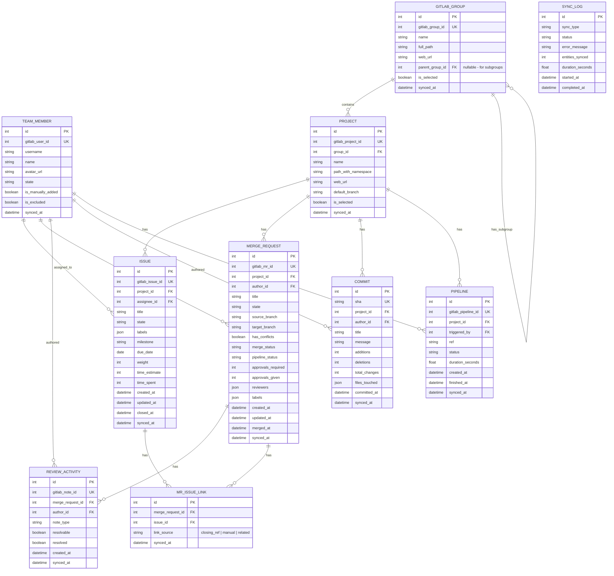
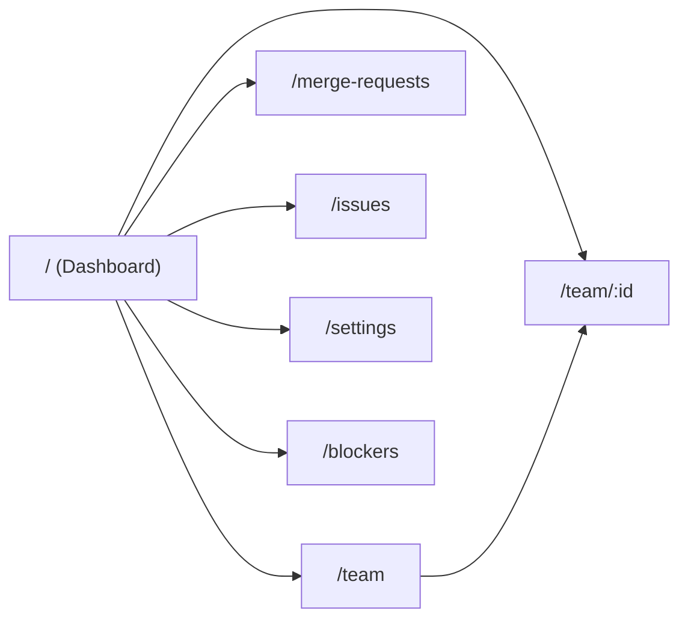

# Tactical Team Manager (TTM) — Requirements & Architecture Plan

> **Version:** 0.1 (Draft)
> **Date:** 2026-07-15
> **Status:** 🟡 Under Review — awaiting sign-off before development begins

---

## 0. Ideation (Not included in the below items)
- Task listing status page that connects task, assignee, task status indicated, and MR deployment status. Everything here should just be a quick data grab except for deploy status as that could take some interpolation to determine if something A. merged, B. had a publish step or another MR that merged later had a publish, and C. Had a followup MR (rinse and repeat)

## 1. Vision & Goals

TTM is a leadership-facing tool that gives tech leads and project managers **at-a-glance visibility** into what every team member is working on in a self-hosted GitLab instance. It is explicitly **not** a developer surveillance tool — it exists to help leadership **preemptively identify blockers**, understand team workload, and (eventually) improve sprint planning.

### Success Criteria

| Criteria | Measure |
|---|---|
| Time-to-insight | A lead can understand the full state of their team in < 30 seconds |
| Blocker detection | Surface stale MRs, unreviewed code, long-running pipelines, overdue issues automatically |
| Sync reliability | Ad-hoc sync completes within 60s for a typical team (≤ 20 members, ≤ 5 projects) |
| Sprint balance *(future)* | Label-based workload distribution visible before sprint commitment |

---

## 2. Constraints & Decisions

These are locked based on the existing skeleton and requirements interview.

| Decision | Choice | Rationale |
|---|---|---|
| GitLab target | **Self-hosted only** | Simpler auth model, no SaaS rate-limit concerns |
| Auth model | **Single Personal Access Token (PAT)** via env var / Docker secret | Standard secret management; no DB exposure of credentials |
| Team membership | **Auto-import from GitLab Group(s)** + manual add/remove overrides | Reduces config burden while allowing flexibility |
| Group scope | **Multiple groups** with configurable subgroup inclusion | Teams span groups; subgroup selection managed in Settings |
| Database | **SQLite** (via `/app/data` volume), with **SQLModel** ORM + **Alembic** migrations | Zero additional infra; SQLModel unifies Pydantic + SQLAlchemy for FastAPI; designed for future Postgres swap |
| User model | **Single-user** initially, architected for multi-user later | Keep auth simple for v1; data model will include a `settings` / `config` table that can evolve into per-user settings |
| Data tables | **MUI DataGrid** (community/free tier) | Built-in sorting, filtering, pagination; no license required |
| Sync horizon | **Last 90 days** by default | Fast initial sync; covers recent sprints; configurable in Settings |
| Commit detail | **Full file list** stored per commit | Enables Phase 2 conflict-zone detection; worth the storage trade-off |
| Frontend | **React Router 7 (SPA mode)** + **MUI v9** | Already scaffolded |
| Backend | **FastAPI** (Python 3.14) + **uv** | Already scaffolded |
| Deployment | **Single Docker container** (multi-stage build) via `compose.yaml` | Already scaffolded |

---

## 3. GitLab Data Model

All data is synced from GitLab via its [REST API v4](https://docs.gitlab.com/ee/api/rest/) using the configured PAT. Below is the entity map for the initial build.

### 3.1 Entities to Sync



### 3.2 GitLab API Endpoints

| Entity | Endpoint | Scope / Notes |
|---|---|---|
| Groups | `GET /groups/:id` | Top-level group metadata |
| Subgroups | `GET /groups/:id/subgroups` | Discover nested subgroups for selection in Settings |
| Group members | `GET /groups/:id/members` | Auto-import team roster (per selected group) |
| Projects | `GET /groups/:id/projects` | Projects in the group (use `include_subgroups=true` when subgroups are selected) |
| Issues | `GET /projects/:id/issues` | Filter by `state`, `updated_after`, `created_after` (90-day horizon) |
| Merge Requests | `GET /projects/:id/merge_requests` | Filter by `state`, `updated_after`, `created_after` |
| MR Notes | `GET /projects/:id/merge_requests/:mr_iid/notes` | Review comments |
| Commits | `GET /projects/:id/repository/commits` | Filter by `since` (90-day horizon); full file list via commit detail endpoint |
| Commit detail | `GET /projects/:id/repository/commits/:sha` | `stats` and `last_pipeline` fields; file-level diff stats |
| Pipelines | `GET /projects/:id/pipelines` | Filter by `updated_after` |
| MR Approvals | `GET /projects/:id/merge_requests/:mr_iid/approvals` | Approval state |
| MR Closing Issues | `GET /projects/:id/merge_requests/:mr_iid/closes_issues` | Issues that will be closed when the MR is merged — populates `MR_ISSUE_LINK` |
| MR Related Issues | `GET /projects/:id/merge_requests/:mr_iid/related_merge_requests` | Additional linkages (if using GitLab issue links) |

### 3.3 Sync Strategy

- **Full sync:** Pulls all data for configured group/projects. Used on initial setup and manual "full refresh."
- **Incremental sync:** Uses `updated_after` / `since` filters to pull only changes since last `synced_at` timestamp. Default for ad-hoc triggers.
- **Rate limiting:** Self-hosted GitLab typically has no rate limits, but the sync worker should respect `RateLimit-*` headers if present.
- **Concurrency:** Sync should use `asyncio` with bounded concurrency (e.g., `asyncio.Semaphore(5)`) to avoid hammering the GitLab instance.

---

## 4. Backend Architecture

### 4.1 Project Structure (Proposed)

```
backend/
├── app/
│   ├── main.py                 # FastAPI app, middleware, startup/shutdown
│   ├── config.py               # Settings (PAT, GitLab URL, group ID, etc.)
│   ├── database.py             # SQLite/async engine, session factory
│   ├── models/                 # SQLAlchemy ORM models (or raw SQL schemas)
│   │   ├── __init__.py
│   │   ├── team_member.py
│   │   ├── project.py
│   │   ├── issue.py
│   │   ├── merge_request.py
│   │   ├── review_activity.py
│   │   ├── commit.py
│   │   ├── pipeline.py
│   │   └── sync_log.py
│   ├── repositories/           # Data access layer (abstracts DB engine)
│   │   ├── __init__.py
│   │   └── ...
│   ├── services/               # Business logic
│   │   ├── __init__.py
│   │   ├── gitlab_sync.py      # Sync orchestrator
│   │   ├── gitlab_client.py    # GitLab API wrapper (httpx)
│   │   ├── blocker_detection.py
│   │   └── dashboard.py        # Aggregation queries for dashboard
│   ├── api/                    # API route modules
│   │   ├── __init__.py
│   │   ├── health.py
│   │   ├── sync.py             # POST /api/sync, GET /api/sync/status
│   │   ├── dashboard.py        # GET /api/dashboard
│   │   ├── team.py             # CRUD for team member overrides
│   │   ├── issues.py
│   │   ├── merge_requests.py
│   │   └── settings.py         # GET/PUT /api/settings
│   └── schemas/                # Pydantic request/response models
│       ├── __init__.py
│       └── ...
├── tests/
│   └── ...
├── pyproject.toml
└── uv.lock
```

### 4.2 Key API Endpoints

| Method | Path | Purpose |
|---|---|---|
| `GET` | `/api/health` | Health check *(exists)* |
| `GET` | `/api/settings` | Retrieve current configuration |
| `PUT` | `/api/settings` | Update GitLab URL, PAT, group ID |
| `POST` | `/api/sync` | Trigger ad-hoc sync (full or incremental) |
| `GET` | `/api/sync/status` | Current sync status / history |
| `GET` | `/api/dashboard` | Aggregated team dashboard data |
| `GET` | `/api/team` | List team members (with override flags) |
| `PUT` | `/api/team/:id` | Toggle exclude/include for a member |
| `POST` | `/api/team` | Manually add a team member |
| `GET` | `/api/issues` | Filterable issue list |
| `GET` | `/api/merge-requests` | Filterable MR list |
| `GET` | `/api/merge-requests/:id/reviews` | Review activity for an MR |
| `GET` | `/api/team/:id/activity` | All activity for a specific member |
| `GET` | `/api/blockers` | Detected blockers (stale MRs, overdue issues, etc.) |

### 4.3 Technology Additions

| Library | Purpose |
|---|---|
| `sqlmodel` | Unified Pydantic + SQLAlchemy models — single source of truth for API schemas and DB tables |
| `alembic` | Database migrations (works with SQLModel's underlying SQLAlchemy metadata) |
| `httpx` | Async HTTP client for GitLab API calls |
| `aiosqlite` | Async SQLite driver |
| `pydantic-settings` | Environment-based configuration (GitLab PAT loaded from env var / Docker secret) |

---

## 5. Frontend Architecture

### 5.1 Page Map



### 5.2 Pages & Components

#### Dashboard (`/`)
The primary landing page — a single-screen summary of the whole team.

| Section | Content |
|---|---|
| **Team Pulse** | Grid of member cards showing avatar, name, and key stats (open issues, active MRs, pending reviews) |
| **Blockers Banner** | Red/amber alert cards for detected blockers (stale MRs, conflicts, failing pipelines, overdue issues) |
| **Activity Feed** | Recent events across the team (issues opened/closed, MRs merged, reviews completed) |
| **Sync Status** | Last sync time, button to trigger ad-hoc sync, sync progress indicator |

#### Team Member Detail (`/team/:id`)

| Section | Content |
|---|---|
| **Profile Header** | Avatar, name, role stats |
| **Assigned Issues** | Table with labels, milestone, due date, weight, state |
| **Authored MRs** | Table with pipeline status, conflict flag, approval state, reviewer list |
| **Review Queue** | MRs where this person is a reviewer but hasn't approved/commented |
| **Commit Activity** | Chart of commit frequency over time, files-touched heatmap |

#### Merge Requests (`/merge-requests`)
Filterable table of all MRs across synced projects, with columns for author, reviewers, pipeline status, conflict indicator, age, approval state, and **linked issue count**.

- **Unlinked MRs tab/filter:** A prominent filter toggle (or dedicated tab) that isolates MRs with zero linked issues. Each row shows the MR title, author, source branch, creation date, and a direct link to the MR in GitLab so the lead can go add the missing reference.
- **Linkage indicator:** A visual badge on each MR row — green checkmark if linked to ≥1 issue, amber warning icon if unlinked.

#### Issues (`/issues`)
Filterable table of all issues with assignee, labels, milestone, weight, due date, and state.

#### Blockers (`/blockers`)
Dedicated view expanding on the dashboard banner — grouped by blocker type with deep links to GitLab.

#### Settings (`/settings`)

| Setting | Type |
|---|---|
| GitLab Instance URL | Text input (read-only, sourced from env var) |
| PAT status | Connection status indicator (token itself sourced from env var, never displayed) |
| GitLab Groups | Multi-select list of groups to sync from |
| Subgroup selection | Tree view — select/deselect subgroups within each group |
| Project selection | Checklist of discovered projects (per group/subgroup) |
| Sync horizon | Number input — how many days back to sync (default: 90) |
| Blocker thresholds | Number inputs (e.g., "MR stale after X days") |

### 5.3 Shared Components

- **AppShell** — Sidebar navigation + top bar with sync status
- **DataTable** — Reusable wrapper around MUI DataGrid (community) with standard column config
- **MemberCard** — Compact team member summary card
- **BlockerChip** — Severity-colored chip for blocker indicators
- **SyncButton** — Trigger sync with loading state
- **StatCard** — Numeric stat with label and trend indicator
- **GitLabLink** — External link chip that opens the entity in GitLab
- **GroupTree** — Tree view for subgroup selection in Settings

---

## 6. Blocker Detection Engine

Blockers are computed server-side on each sync. These are heuristic-based and the thresholds should be configurable in Settings.

| Blocker Type | Default Threshold | Signal |
|---|---|---|
| **Stale MR** | Open > 5 days with no activity | MR `updated_at` age |
| **Merge Conflicts** | Any MR where `has_conflicts = true` | GitLab merge status |
| **Failing Pipeline** | Latest pipeline on MR is `failed` | Pipeline status |
| **Unreviewed MR** | Open > 2 days with 0 review comments | Review activity count |
| **Blocked Approval** | MR has `approvals_given < approvals_required` and is > 3 days old | Approval data |
| **Overdue Issue** | Issue `due_date` is in the past and `state = opened` | Due date check |
| **Review Bottleneck** | A single reviewer has > 5 pending reviews | Aggregate reviewer load |
| **Heavy WIP Load** | A single member has > 5 open assigned issues | Aggregate issue count |
| **Unlinked MR** | MR has no entries in `MR_ISSUE_LINK` (no closing references, no manual links) | Join count = 0 |
| **Orphan MR (No Author Match)** | MR author is not in the synced team roster | Author ID not in `TEAM_MEMBER` |

> [!IMPORTANT]
> **Unlinked MR triage workflow:** When an unlinked MR is detected, TTM surfaces it with the MR title, author, source branch, and a direct deep-link to the MR in GitLab. The lead can then go to GitLab and add the closing reference (e.g., `Closes #123`) or link the issue manually. On the next sync, TTM picks up the new linkage and clears the blocker. TTM itself does **not** write back to GitLab — it is read-only.

---

## 7. Sprint Planning Module *(Future — Phase 2)*

> [!NOTE]
> This section outlines the **future direction** and is not in scope for the initial build. It is included here so the data model and architecture can accommodate it from day one.

### 7.1 Problem Statement
GitLab's sprint planning (milestone + boards) lacks:
- **Workload balancing** — no visibility into whether a sprint is lopsided toward one label category (e.g., all backend, no frontend).
- **Capacity planning** — no understanding of individual member load vs. availability.
- **Conflict risk analysis** — no way to see if too many issues target the same files/areas.

### 7.2 Planned Capabilities

| Feature | Description |
|---|---|
| **Label Category Breakdown** | Visualize sprint issues by label (e.g., `backend`, `frontend`, `devops`, `bugfix`) as a stacked bar chart |
| **Sprint Weight Distribution** | Compare total issue weight assigned to each team member vs. their capacity |
| **Auto-Rebalance Suggestions** | AI-assisted suggestions to move issues between members to balance the sprint |
| **Conflict Zone Detection** | Identify issues whose labels/files overlap, flagging merge conflict risk |
| **Issue Auto-Labeler** | Suggest labels for new issues based on title/description + historical patterns |

### 7.3 Data Model Extensions (Phase 2)

- `SPRINT` table (maps to GitLab milestones with additional TTM metadata)
- `SPRINT_MEMBER_CAPACITY` table (member availability per sprint)
- `LABEL_CATEGORY` table (group labels into higher-level categories)
- `CONFLICT_ZONE` table (predicted overlap areas)

---

## 8. Implementation Phases

### Phase 1: Foundation & Core Sync *(Target: First)*

```mermaid
gantt
    title Phase 1 — Foundation & Core Sync
    dateFormat X
    axisFormat %s

    section Backend
    Config & Settings API           :a1, 0, 1
    Database schema & migrations    :a2, 0, 1
    GitLab API client               :a3, 1, 2
    Sync engine (full + incremental):a4, 2, 4
    Dashboard aggregation API       :a5, 4, 5
    Blocker detection engine        :a6, 4, 5
    Team management API             :a7, 1, 2

    section Frontend
    App shell & navigation          :b1, 0, 1
    Settings page                   :b2, 1, 2
    Dashboard page                  :b3, 2, 4
    Team roster & member detail     :b4, 3, 5
    MR & Issue list pages           :b5, 4, 5
    Blockers page                   :b6, 5, 6
```



#### Phase 1 Deliverables
1. **Settings page** — configure GitLab URL, PAT, Group ID
2. **Sync engine** — ad-hoc full and incremental sync via API + UI button
3. **Dashboard** — team pulse, blocker banner, activity feed
4. **Entity pages** — filterable tables for MRs and Issues
5. **Team views** — roster with member detail pages
6. **Blocker detection** — all 8 heuristic blocker types

### Phase 2: Sprint Planning *(Future)*
- Sprint/milestone sync
- Label category management
- Workload distribution visualizations
- Auto-rebalance suggestions

### Phase 3: Scheduled Sync & Notifications *(Future)*
- Cron-based background sync (APScheduler or similar)
- Webhook ingestion from GitLab for real-time updates
- Optional email/Slack notifications for blocker alerts

### Phase 4: Multi-User & Collaboration *(Future)*
- User accounts with GitLab OAuth
- Per-user team/group scoping
- Shared dashboards and saved filters

---

## 9. Non-Functional Requirements

| Category | Requirement |
|---|---|
| **Security** | PAT stored encrypted at rest; never exposed in API responses; all settings mutations require confirmation |
| **Performance** | Dashboard loads in < 1s from local SQLite; sync supports incremental mode to minimize API calls |
| **Resilience** | Sync failures are logged and don't corrupt existing data; partial syncs are idempotent |
| **Observability** | `SYNC_LOG` table tracks every sync attempt with duration, entity count, and error details |
| **Portability** | Single `docker compose up` deploys the entire stack; zero external dependencies beyond the GitLab instance |
| **Extensibility** | Repository pattern on the data layer; service layer decoupled from API layer; frontend uses a typed API client |

---

## 10. Open Questions

> [!TIP]
> All previously open questions have been resolved and their decisions are reflected in Section 2 (Constraints & Decisions) above.

| # | Question | Impact |
|---|---|---|
| 1 | What GitLab PAT scopes are needed? Likely `read_api` at minimum — do we also need `read_repository` for commit file-level detail? | GitLab configuration |
